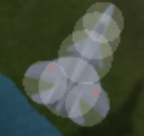

<!--ts-->
   * [tutorial](#tutorial)
   * [hosting a server](hosting.md)  
   * [Concepts](#concepts)
      * [Circles.. everywhere](#circles-everywhere)
      * [Mobs](#mobs)
      * [Mountains](#mountains)
      * [Players](#players)
      * [Particles &amp; Sprites](#particles--sprites)
      * [Graphics - pixi.js](#graphics---pixijs)
      * [Sound - howler.js](#sound---howlerjs)
      * [UI - jQuery](#ui---jquery)
      * [Networking](#networking)
      * [Clock](#clock)
      * [Horizon](#horizon)
      * [Movement Prediction](#movement-prediction)
      * [Key State](#key-state)
   * [Networking In Depth](#networking-in-depth)
      * [Scoreboard --](#scoreboard---)
      * [Chat -- CHAT_PUBLIC / CHAT_TEAM / CHAT_SAY / CHAT_WHISPER](#chat----chat_public--chat_team--chat_say--chat_whisper)
      * [Votes -- CHAT_VOTEMUTED / CHAT_VOTEMUTEPASSED](#votes----chat_votemuted--chat_votemutepassed)
      * [Spawning/Modifying A Mob -- MOB_UPDATE](#spawningmodifying-a-mob----mob_update)
      * [Removing A Mob -- MOB_DESPAWN](#removing-a-mob----mob_despawn)

<!-- Added by: airmash addict at: Tue  3 Dec 19:48:23 GMT 2019 -->

<!--te-->

# tutorial
Work-in-progress crash course explaining how Airmash works and how to hack on it

This isn't even slightly complete, just a bunch of notes to pad out. Send pull requests liberally!

# Concepts

## Circles.. everywhere

game internally represents all objects as circles. most planes are 3 circles. missiles, mountains etc. why? very cheap and easy to calculate when 2 circles overlap -- which is how collision detection works. server must calculate this for every circle for every animation frame so it must be fast, hence circles

include screenshots of planes with their circles overlaid, include mountain map with circles etc

tornados are real dicks:

heli:

now you know why it's easier to hit a heli side-on than front on!

goli:

prow:

## Mobs

boxes and missiles are 'mobs'. they have associated velocity and when plane collides with them, server does interesting things

- missile collide -- update health, maybe send death message

- box collide -- ups / shield / etc

mobs enter and leave existence very quickly. think about heli fire -- they're just a lot of very short lived mobs

sketch out key properties of a mob and show example for heli missile

## Mountains

mountains are basically just big lists of circles that are baked into the client. the client reads this during startup and uses it to draw a static map. on the server, the same list is used to detect when plane or missile collides with mountain, and causes bounce/explosion message

modifying map requires updating this list -- plans exist to make it dynamic and therefore easy to sync between client/server but the work hasn't been done yet. for now the map is basically fixed because it requires server and client to be in sync

## Players

## Particles & Sprites

Particles -- neat effects like missile smoke

Sprites -- mobs / players / mountains / etc. mostly anything that remains on screen long term

## Graphics - pixi.js

??? someone else write this. works in terms of layers containing sprites, exposes all of WebGL to the game.

## Sound - howler.js

works in terms of sprites, all kinds of fun toggles such as pitch shifting available.

## UI - jQuery

handles things like scoreboards, "destroyed by" messages etc.

## Networking

primary / backup websockets. the backup gives a 50% reduction in chance of critical message being delayed by TCP "retransmit timer". describe which messages are sent using both vs. just primary

messages are encoded in binary using a pretty cool custom encoding. in js they are represented as objects with nice named properties, on the wire they're junk

client ignores message ids it doesn't know about, so some extension is possible without breaking starmash

## Clock

majority of messages include a timestamp generated by the server, it's used for a ton of stuff

- deduplicates messages sent on backup+primary sock, timestamp is always unique
- used to compensate for latency in client movement prediction rendering. e.g. if client knows it's behind by 60ms, it'll "smear" its on-screen movement updates to try to hide the impact of latency by showing a missile/plane further in the future than where it really is.
- ??

## Horizon

Many messages aren't sent by server unless they relate to another player or mob appearing within the user's viewport. This is both the cause and the cure for the classic zoom hack

## Movement Prediction

Client & Server calculate same data, server updates client when any state
changes. That's why sometimes planes fly through mountains with bad wifi --
server position update message did not arrive at client indicating 'bounce'

## Key State

Client / server both maintain key state. Server uses it to generate canonical movement which is then broadcast to all 

# Networking In Depth

## Scoreboard -- 

## Chat -- CHAT_PUBLIC / CHAT_TEAM / CHAT_SAY / CHAT_WHISPER

## Votes -- CHAT_VOTEMUTED / CHAT_VOTEMUTEPASSED

## Spawning/Modifying A Mob -- MOB_UPDATE

## Removing A Mob -- MOB_DESPAWN

custom messages

